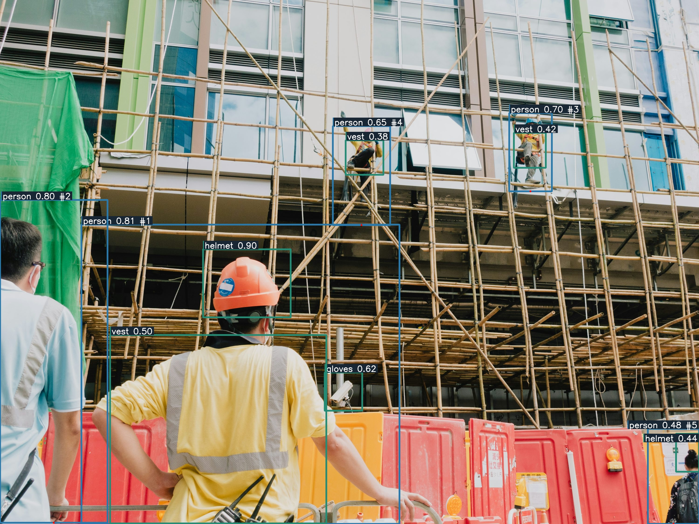
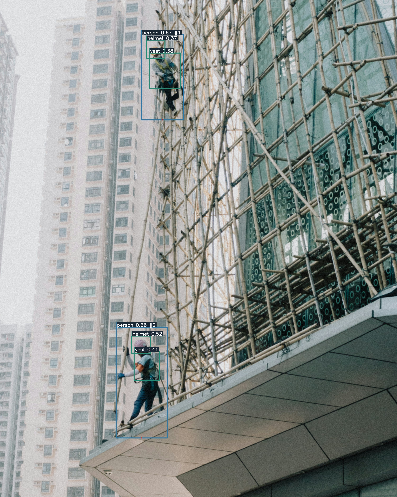
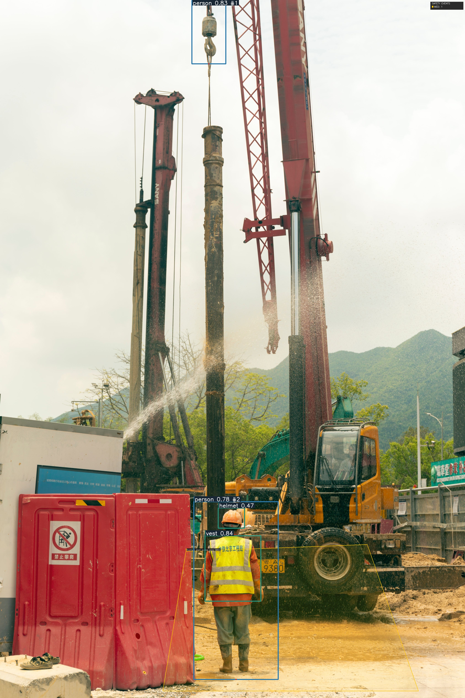
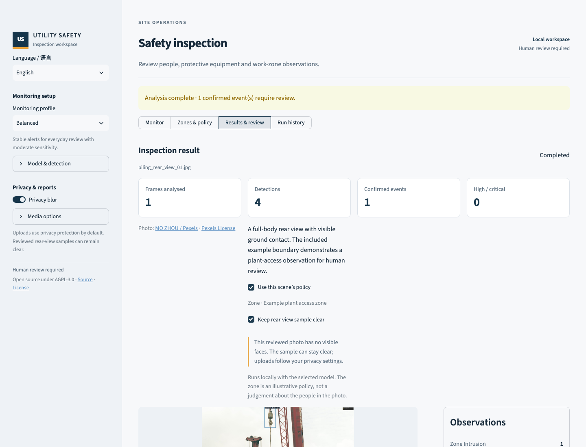
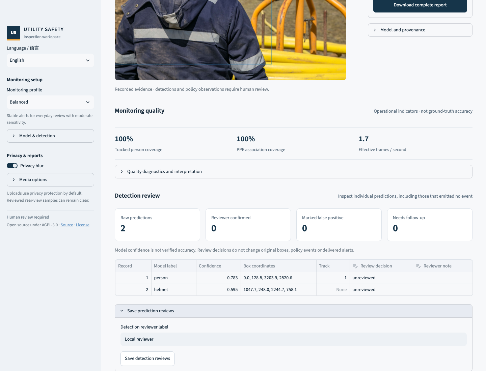

<div align="center">

# Utility Site Safety AI

**From camera observations to reviewable safety events.**

[](https://github.com/MengyangGao/utility-site-safety-ai-system/actions/workflows/ci.yml)

[](LICENSE)

A local construction and infrastructure monitoring demo with bundled PPE models,
zone policies, temporary tracking, private evidence and durable integrations.



*Hong Kong building works — real person/PPE detections from the bundled model. Photo: [Catgirlmutant / Unsplash](https://unsplash.com/photos/a-man-wearing-a-hard-hat-BRQQtnsG2do).*

[Quick start](#quick-start) · [Operating guide](docs/guide.md) · [Integrations](docs/integrations.md) · [Validation](docs/modernization.md)

</div>

## What it does

- Processes images, video files, webcams and RTSP streams using the existing YOLO detection pipeline.
- Associates supported PPE observations with people and evaluates normalized polygon zones,
  dwell times, consecutive-frame confirmation and repeat-alert cooldowns.
- Keeps live capture bounded: open/read timeouts, TCP by default for RTSP, a latest-frame
  mailbox, reconnect budgets, stale-frame rejection and explicit continuity segments.
- Redacts detected faces or estimated head regions before saving uploaded/camera evidence.
  Three reviewed rear-view photo examples can remain clear, with their exact file hash and privacy
  reason recorded. Model usage analytics are disabled in this process.
- Records annotated media, snapshots, source/model hashes, events, observation lifecycles,
  capture timestamps and processing diagnostics.
- Delivers events during inference through a durable SQLite outbox. Supports signed webhooks,
  optional MQTT QoS 1, and an authenticated local REST API.
- Reviews raw predictions even when no policy event was emitted. Paginated detection records
  show model label, confidence, bounding box and frame, with separate human decisions.
- Appends operator review history while retaining the original run evidence and manifest.

The project fits inspection workflows around utility corridors, excavation edges, plant exclusion
zones and other infrastructure worksites. [Example scenarios](docs/scenarios.md) include a Hong Kong
construction context. The sample policies are illustrative and require camera-specific calibration.

## Quick start

Use Python 3.11 and [uv](https://docs.astral.sh/uv/getting-started/installation/).
Install **FFmpeg** for H.264 browser video playback; image analysis works without it.

```bash
git clone https://github.com/MengyangGao/utility-site-safety-ai-system.git
cd utility-site-safety-ai-system
uv sync --locked
uv run utility-safety-ai web
```

Open **http://127.0.0.1:8501**, choose a scene and select **Run included sample**.
The three real construction photos show workers from behind, without visible faces; the reviewed
sample stays clear while uploads retain privacy protection by default. Results open automatically.
You can inspect evidence, record a review decision and download the report.

The two small checkpoints and example inputs ship in both the checkout and wheel. A default run
does not download a model. For pip/Conda environments, `pip install .` is also supported; `uv.lock`
is the reproducible CPU reference environment on Linux/Windows, with the standard MPS-capable
PyTorch wheel on macOS. See [development](docs/development.md) for GPU environment choices.

## Try the CLI

```bash
uv run utility-safety-ai infer-image \
  --source examples/sample_images/piling_rear_view_01.jpg \
  --zones examples/zones_piling_rear_view.yaml \
  --no-blur-faces \
  --output outputs/image-demo

uv run utility-safety-ai infer-video \
  --source examples/sample_videos/construction_ppe_pan.mp4 \
  --zones examples/zones_construction_site_ppe_01.yaml \
  --output outputs/video-demo

# Bounded live capture; use an environment variable for credential-bearing URLs.
export UTILITY_SAFETY_CAMERA_SOURCE='rtsp://camera/stream'
uv run utility-safety-ai infer-camera --duration 300 --output outputs/camera-demo
```

Use `--privacy-mode solid` or `pixelate` for alternative redaction, and `--no-blur-faces`
only when unredacted output is intentional. `--profile` selects a heuristic operating preset;
profile names do not represent measured accuracy guarantees.

## Detection gallery: building and civil works

These are model-annotated outputs from real photographs, not raw stock images or mock detection boxes.
The two Hong Kong locations are identified by the photographer. The piling scene contains Chinese-language
site signage; its exact city is not verified.

| Tsuen Wan, Hong Kong · façade scaffolding | Piling works · illustrative access zone |
| --- | --- |
|  |  |
| [Catgirlmutant / Unsplash](https://unsplash.com/photos/a-man-on-a-scaffold-working-on-a-building-PW-jyG50hpc) | [MO ZHOU / Pexels](https://www.pexels.com/photo/man-in-uniform-working-at-construction-site-4311990/) |

The publicly licensed gallery images are shown without privacy redaction, and that setting is recorded
in their manifests. Uploaded and live-camera media still default to privacy protection. Predictions include false positives (for example, the CCTV camera in the first image is labeled
`gloves`); these raw outputs are retained for review. The boxes are not verified violations,
fall-protection certification or an accuracy benchmark.

Reproduce these outputs with `uv run python tools/render_readme_gallery.py`.
[Run settings and hashes](docs/validation/readme-gallery.json) · [Image credits and licenses](docs/legal/sample-photos.md)

<details>
<summary>Application workspace and evidence review</summary>





</details>

## Sample scenes

| Scene | What to inspect |
| --- | --- |
| Utility corridor | Rear-view helmet and reflective jacket; PPE observations only |
| Waterfront crew | Two workers from behind; review headwear/vest detections and omissions |
| Piling works | Full-body rear view; an illustrative plant-access boundary |

No automatic claim of anonymity is made for arbitrary inputs. The clear-sample option applies
only to the exact reviewed files; changing a file invalidates that exception. People and
organizations pictured do not endorse the project. See [sources and usage](docs/legal/sample-photos.md).

## Pipeline

```text
Image / file / camera / RTSP
              ↓
    bounded capture → latest frame       (live sources)
              ↓
     YOLO → temporary person tracking
              ↓
     person ↔ PPE association + zone policy
              ↓
     temporal confirmation + cooldown
              ↓
     privacy processing → evidence + hashed run manifest
              ↓
     SQLite event index + delivery outbox
        ↙             ↓               ↘
   dashboard       REST API       webhook / MQTT
```

The detector, association rules, model artifacts and Streamlit application remain the foundation.
There is no mandatory broker, database server, hosted account or enterprise control plane.
See [architecture](docs/architecture.md) for contracts and failure behavior.

## Integrations

```bash
# The receiver is operator configured. Delivery starts as events are recorded.
export UTILITY_SAFETY_WEBHOOK_URL='https://your-receiver.example/events'
export UTILITY_SAFETY_WEBHOOK_SECRET='your-shared-signing-secret'
uv run utility-safety-ai infer-video --source worksite.mp4 --output outputs/edge

# Retry queued deliveries after a process restart or connectivity outage.
uv run utility-safety-ai deliver-pending --output outputs/edge

# Local authenticated API over the same event database.
export UTILITY_SAFETY_API_TOKEN='a-random-token-at-least-24-characters-long'
uv run --extra api utility-safety-ai api --output outputs/edge
```

The API exposes cursor-based events, protected snapshot access and review history at
**http://127.0.0.1:8080/docs**. Webhooks include a timestamp, HMAC signature and stable
idempotency key. MQTT is optional: `uv sync --locked --extra mqtt`, then configure the broker
through environment variables. Both send event metadata, without camera URLs or raw media.
See [integration contracts](docs/integrations.md) for authentication, retries and MQTT settings.

## Evidence and limitations

Each run has its own directory under `outputs/<name>/runs/<run-id>/`. Only completed runs update
`latest.json`; failures retain diagnostics. The integration database sits at
`outputs/<name>/events.sqlite3`. Original run hashes are finalized before operator reviews.

**Detection review** is separate from event review. Each record has a stable identifier
bound to the run ID, original detection-log SHA-256 and record number. The app verifies the
log before reading and again before saving; changed or replaced evidence fails explicitly.
Review pages contain up to 25 predictions. Save decisions before changing pages.

Mark a prediction `confirmed`, `false_positive`, or `needs_follow_up`, with a reviewer label
and optional note. Counts show the latest human decisions separately from raw model counts;
these are not precision/recall metrics. Decisions do not erase boxes, retract delivered alerts
or retrain the model. The report ZIP includes `detection_review_history.json` alongside the
original evidence and event review history. Each decision retains its evidence hash, so
older decisions can still be distinguished if a run ID was intentionally reused.

The current PPE model has worn-PPE classes and explicit `no_helmet`, `no_goggle`, `no_gloves`
and `no_boots` labels. It has **no `no_vest` class**. Absence of a positive detection remains
`unknown`; it is not treated as proof of missing PPE. Historical model metrics, weak classes,
training details and hashes are retained in the [model card](docs/model-and-data.md).

Automatic redaction can miss people or identifying details. Review footage before sharing it.
Tracking IDs represent temporary observations, not verified identities. Reconnection resets
continuity; a missing observation or stopped camera is not evidence that a hazard is resolved.

The included video is a pan over a licensed still image, not a real monitored construction site.
Real loopback RTSP interruption/recovery, MQTT delivery, webhook retries, wheel inference and browser
playback have been tested; physical cameras, new deployment accuracy and unattended field operation
have not. Read the [validation record](docs/modernization.md) and [security policy](.github/SECURITY.md).

## Development and license

```bash
uv sync --locked --extra dev
uv run --extra dev pytest --cov=utility_safety_ai --cov-fail-under=75
uv run --extra dev ruff check .
uv run --extra dev ruff format --check .
uv run --extra dev mypy src/utility_safety_ai
uv run utility-safety-ai audit-provenance
uv build
```

[Development and optional integration checks](docs/development.md) · [Model evaluation](docs/model-evaluation/ppe_yolo11n-v1/README.md)

Code is released under [AGPL-3.0](LICENSE). The photographs retain their separate
[Pexels/Unsplash licenses and photographer credits](docs/legal/sample-photos.md); they are not relicensed
as AGPL or used as ground-truth safety labels. Other models and examples retain their recorded
licenses. This software assists visual review; a human must assess alerts.
