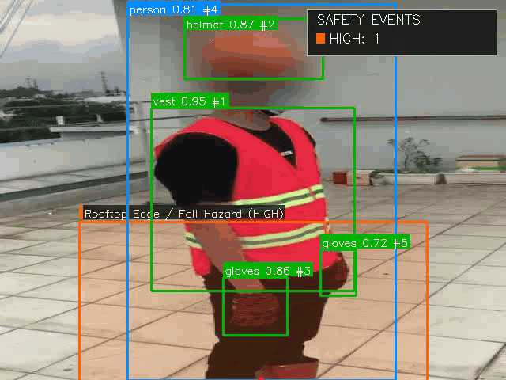
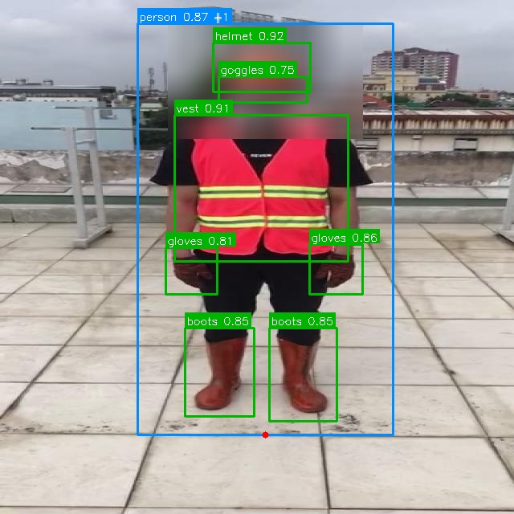
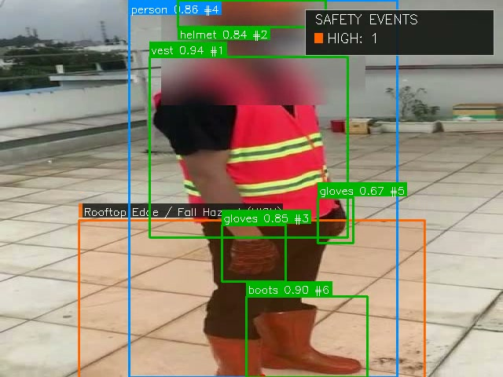

<div align="center">

# Utility Site Safety AI

**PPE compliance and restricted-zone monitoring for utility and construction worksites.**

[](https://github.com/MengyangGao/utility-site-safety-ai-system/actions/workflows/ci.yml)
[](https://www.python.org/)
[](LICENSE)

Turn images, video, cameras, and RTSP streams into live safety findings, privacy-protected evidence,
and downloadable reports—on a laptop, with a bundled PPE model.



<br>
<a href="docs/assets/safety-monitoring-demo.mp4">▶ Watch the annotated MP4 demo</a>

</div>

## Web dashboard


## Detection examples

<table>
  <tr>
    <td width="33%" align="center">
      <br>
      <b>Person + restricted-zone monitoring</b>
    </td>
    <td width="33%" align="center">
      <br>
      <b>PPE + restricted-zone alert</b>
    </td>
    <td width="33%" align="center">
      <br>
      <b>Person-level PPE detection</b>
    </td>
  </tr>
</table>

## Video monitoring

<table>
  <tr>
    <td width="50%" align="center">
      <br>
      <b>Temporary tracking + PPE association</b>
    </td>
    <td width="50%" align="center">
      <br>
      <b>Confirmed restricted-zone event</b>
    </td>
  </tr>
</table>

## What you can do

- Detect people, helmets, vests, gloves, boots, goggles, and explicit missing-PPE classes.
- Draw normalized polygon zones and raise intrusion alerts when a person enters them.
- Track people temporarily across video frames and suppress repeated alerts.
- Combine PPE and zone findings into `low`, `medium`, `high`, and `critical` risks.
- Blur or pixelate privacy-sensitive regions before media is saved.
- Review results in a bilingual Streamlit dashboard and download a complete report ZIP.
- Process images, videos, webcams, and RTSP streams from the Web UI or CLI.
- Save annotated media, snapshots, events, detections, compliance records, and run summaries.

## Quick start

Python 3.11 is recommended. The bundled models keep the first run fully local.

```bash
conda create -n utility-safety-ai python=3.11 -y
conda activate utility-safety-ai
pip install -e .
utility-safety-ai web
```

Open the displayed local URL, keep **PPE + restricted-zone monitor** selected, then upload an image
or video. Privacy blur is enabled by default.

## Run the included samples

```bash
# Image: PPE + restricted-zone result
utility-safety-ai infer-image \
  --source examples/sample_images/construction_site_ppe_01.jpg \
  --zones examples/zones_construction_site_ppe_01.yaml \
  --output outputs/image-demo \
  --blur-faces

# Video: tracking + temporal alert confirmation
utility-safety-ai infer-video \
  --source examples/sample_videos/construction_ppe_pan.mp4 \
  --zones examples/zones_construction_site_ppe_01.yaml \
  --output outputs/video-demo \
  --blur-faces
```

The default model is `models/ppe_yolo11n.pt`; no model download is required.

## Other inputs

```bash
# Webcam
utility-safety-ai infer-camera --source 0 --max-frames 300 --blur-faces

# RTSP camera
utility-safety-ai infer-camera --source "rtsp://camera/stream" --blur-faces

# General person + zone model
utility-safety-ai infer-video --source worksite.mp4 --model models/yolo11n.pt
```

## Define a safety zone

Normalized coordinates work across different input resolutions:

```yaml
zones:
  - id: high_voltage_area
    name: High Voltage Area
    coordinate_space: normalized
    risk_level: high
    required_ppe: [helmet, vest]
    polygon:
      - [0.15, 0.40]
      - [0.85, 0.40]
      - [0.90, 0.95]
      - [0.10, 0.95]
```

Use it with `--zones zones.yaml`, or edit zones visually in the Web console.

## Results

Every run receives its own folder under `outputs/<name>/runs/<run-id>/`:

```text
images/ or videos/       annotated result
snapshots/               alert evidence
events/events.*          safety events
events/detections.*      all detections
events/compliance.*      person-level PPE status
events/summary.*         report summary
quality.*                processing indicators
manifest.json            input, model, settings, and artifact hashes
```

## Included models

| Model | Size | Best for |
|---|---:|---|
| `models/ppe_yolo11n.pt` | 5.2 MB | PPE, people, and restricted zones |
| `models/yolo11n.pt` | 5.4 MB | People and restricted zones |

The PPE checkpoint was fine-tuned from YOLO11n on the 11-class
[Ultralytics Construction-PPE dataset](https://docs.ultralytics.com/datasets/detect/construction-ppe/).
See [models and training](docs/model-and-data.md) for class coverage, evaluation, fine-tuning, and
export commands.

## How it works

```text
Image / Video / Camera / RTSP
              ↓
         YOLO detection
              ↓
      Temporary tracking
        ↙             ↘
 Person ↔ PPE      Zone geometry
        ↘             ↙
        Safety rule engine
              ↓
 Privacy blur · Evidence · Reports
```

## Learn more

- [User guide](docs/guide.md)
- [Models and training](docs/model-and-data.md)
- [Model evaluation](docs/model-evaluation/ppe_yolo11n-v1/README.md)
- Run `utility-safety-ai --help` for the complete command reference.

## License

Released under the [GNU Affero General Public License v3.0](LICENSE). The included Ultralytics
models and Construction-PPE-derived examples use the same open-source license.

> This software assists visual review; confirm every alert before taking action.
