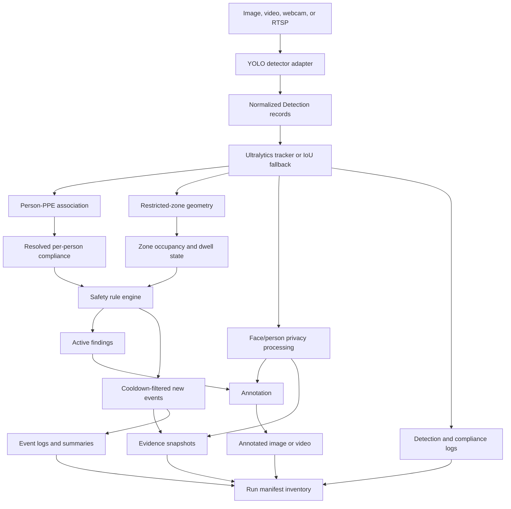

# Architecture

## Design goals

Utility Site Safety AI is organized around five engineering properties:

1. **Capability honesty:** behavior follows the loaded model's actual classes.
2. **Deterministic safety logic:** geometry and escalation are inspectable and testable without a neural model.
3. **Temporal clarity:** a currently visible finding is different from a newly persisted event.
4. **Privacy before persistence:** saved evidence is produced from the privacy-processed frame.
5. **Audit isolation:** each run owns its artifacts and cannot silently erase another run.

## Processing flow



## Core records

### Detection

Every detector output is normalized to:

```text
class_id, class_name, confidence, bbox=(x1,y1,x2,y2), track_id
```

The adapter submits the user-selected global confidence to Ultralytics, making it a true minimum for every class. It then applies any stricter per-class floor. Ultralytics already performs NMS; the application does not run a second broad suppression pass.

### PersonCompliance

PPE boxes are assigned to the most plausible person using overlap and center containment. State is resolved once per person and PPE type:

- `yes`: positive PPE evidence exists;
- `no`: explicit negative evidence exists and is not contradicted by positive evidence;
- `unknown`: neither was observed.

Positive evidence conservatively wins a same-type contradiction. Repeated same-type negative boxes select one highest-confidence evidence record. Conflict evidence remains available to compliance reporting.

### SafetyEvent

An event contains a UUID, UTC timestamp, source, frame/time position, risk, type, description, temporary track ID, bounding box, optional zone, optional snapshot, and metadata.

## Rule lifecycle

`RuleEngine.evaluate_frame()` returns two lists:

- `active_findings`: everything currently true, used for on-screen annotation;
- `new_events`: the cooldown-filtered subset used for snapshots and persistent event logs.

This prevents a ten-second cooldown from making a still-active hazard disappear visually.

Default rules include:

| Condition | Default risk |
|---|---|
| Explicit missing gloves | low |
| Explicit missing helmet/vest/boots/goggles | medium |
| Restricted-zone intrusion | zone risk (normally high) |
| Two or more distinct PPE violation types | at least high |
| Missing helmet while a zone event is active | critical zone event |

Cooldown keys combine temporary track ID, event type, and zone ID. Zone dwell state resets after the person leaves. The engine resets between sources/runs and also detects a restarted timebase.

## Zone model

A `Zone` contains:

- stable ID and display name;
- `low`, `medium`, `high`, or `critical` risk;
- a polygon;
- `pixels` or `normalized` coordinate space;
- optional required-PPE list;
- optional non-negative dwell time.

Normalized polygons use `[0,1]` coordinates and are converted with `(frame_width, frame_height)` for both evaluation and drawing. The person's bounding-box bottom center is the intrusion point.

Strict parsing rejects missing files, duplicate IDs, unsupported fields, non-finite coordinates, degenerate polygons, unsupported PPE, and normalized values outside `[0,1]`.

## Tracking

Ultralytics tracking is used when it produces IDs. The fallback tracker performs short-lived IoU matching for people only. It:

- resets at each run;
- ages tracks through empty frames;
- preserves upstream IDs in mixed frames;
- does not claim biometric identity or cross-camera continuity.

IDs are operational correlation keys, not identities.

## Privacy order

For every frame:

1. Detection and rules operate on the working frame/detections.
2. A display-frame copy is created.
3. Exact detected face boxes are blurred.
4. A person without an associated face receives the conservative upper-person fallback.
5. Annotations are drawn on a copy of the privacy-processed display frame.
6. Event snapshots are cropped from the privacy-processed display frame.
7. Annotated media and snapshots are persisted.

The original decoded frame is not written by the normal pipelines. This is still a privacy aid, not a guarantee that every face or identifying feature was removed.

## Run lifecycle and filesystem contract

```text
<output-root>/
├── latest.json
└── runs/
    └── <run-id>/
        ├── manifest.json
        ├── images/
        ├── videos/
        ├── snapshots/
        └── events/
```

The lifecycle is:

1. Validate/decode input before creating a run where possible.
2. Create an isolated run directory; refuse collision unless overwrite is explicit.
3. Write a `running` manifest.
4. Initialize valid empty logs.
5. Process and persist frames.
6. Validate final media.
7. Write summaries and artifact inventory.
8. Atomically finalize the manifest and publish `latest.json`.

On failure, the run manifest records error type/message and discovered artifacts. It does not replace the latest successful pointer.

The artifact inventory records path, size, and SHA-256 for files present when the core manifest is finalized. The Web layer adds `web_run_manifest.json` afterward as a presentation/session record; it should not be mistaken for a file already covered by the core manifest inventory.

## Pipeline responsibilities

### Image

- Validate a readable source image.
- Predict once and assign temporary person IDs.
- Evaluate active/new findings.
- Save one annotated image and all tabular artifacts.

### Video

- Validate the first frame and writer before processing.
- Maintain tracker/rule state over frames.
- Persist all detections, changed compliance states, and new events.
- Save active findings on every annotated frame.

### Camera/RTSP

- Use monotonic elapsed time.
- Bound runtime by duration and/or frame count.
- Redact credentials in audit source text.
- Attempt bounded reconnects and always release capture/writer resources.

## Web architecture

Each browser session receives a random output root under:

```text
outputs/web_demo/sessions/<session-id>/
```

Detector, tracker, and rule engine state are run-scoped, not globally shared cached resources. The UI retains at most 20 run records in session state. Uploaded files use temporary lifetimes. Zone editing occurs in normalized coordinates and is converted only at the domain boundary.

The Web UI is a local demo surface, not an authenticated multi-tenant service.

## Trust boundaries and failure modes

| Boundary | Failure examples | Current response |
|---|---|---|
| Media decode | corrupt/truncated image or video | fail with non-zero error; do not publish successful latest pointer |
| Model file | missing explicit path, incompatible/untrusted checkpoint | fail fast for missing paths; operators must trust/checksum model content |
| Zone input | typo, degenerate polygon, invalid normalized point | schema validation error |
| Live source | disconnect, invalid FPS, headless display | bounded reconnect/fallback FPS/actionable display error |
| Output | writer/imwrite failure, filesystem error | checked write and failed manifest |
| Privacy | missed face, identifying clothing/background | face/person blur aid plus operator review; no guarantee |
| Model semantics | COCO model selected for PPE workflow | model class audit and honest person+zone-only capability |
| Licensing | incompatible model/dataset/deployment terms | explicit notices; deployment owner must review/obtain terms |

## Extension points

- Detector adapters can emit the same `Detection` record.
- Tracker implementations can preserve the temporary ID contract.
- Zone/rule policies can be extended without changing model inference.
- Event sinks can consume `new_events` for webhooks/MQTT after authentication and retry design.
- Database/object-storage backends can implement the run artifact contract.
- Exported inference runtimes must preserve class names, thresholds, tracking, privacy order, and regression evidence.
