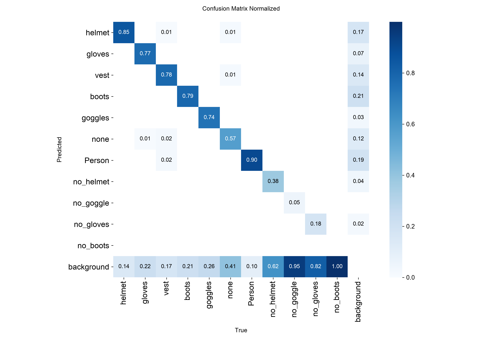
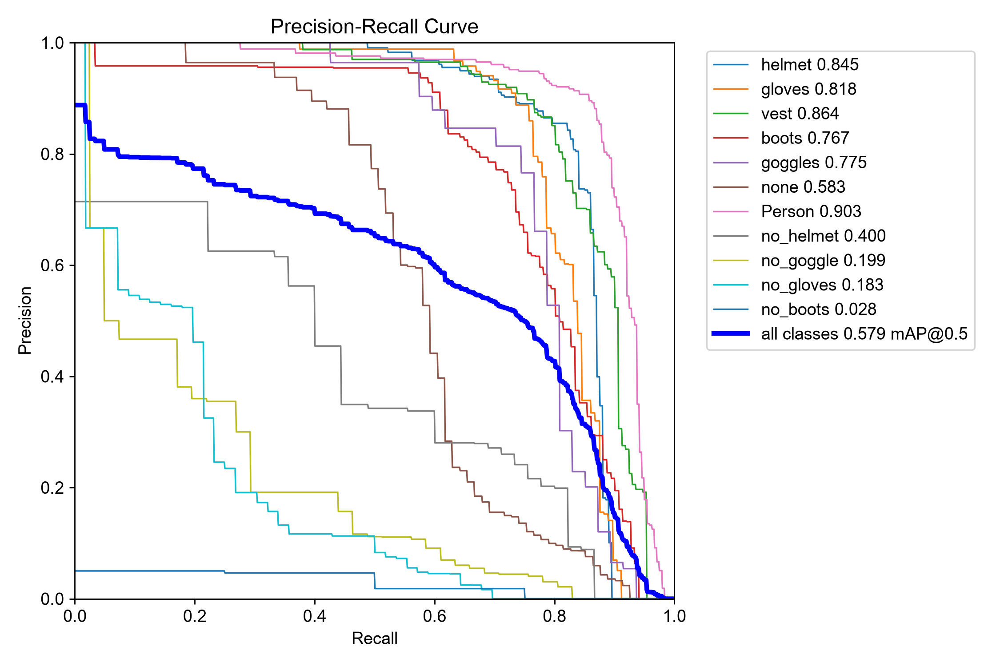

# PPE YOLO11n evaluation

Results below belong to the bundled `models/ppe_yolo11n.pt` checkpoint (SHA-256
`b05d39dba9d9a5a19855b9cc7dc4c613e979a64a280929e593522685c19cefff`). It was evaluated on the
143-image Construction-PPE validation split using CPU inference.

| Precision | Recall | mAP50 | mAP50-95 |
|---:|---:|---:|---:|
| 0.6903 | 0.5515 | 0.5786 | 0.2860 |

| Class | mAP50 |
|---|---:|
| Person | 0.9026 |
| Vest | 0.8635 |
| Helmet | 0.8448 |
| Gloves | 0.8184 |
| Goggles | 0.7748 |
| Boots | 0.7672 |
| No helmet | 0.3998 |
| No goggles | 0.1986 |
| No gloves | 0.1835 |
| No boots | 0.0285 |

The validation split contains only four `no_boots` instances and no `no_vest` class. Use the model
for demonstrations and verify alerts against footage from the intended camera before relying on its
results.

## Visual results

<table>
  <tr>
    <td></td>
    <td></td>
  </tr>
</table>

## Runtime snapshot

Detector-only timing on an Apple M4 Pro with a 640 × 640 synthetic frame:

| Device | FPS | ms/frame |
|---|---:|---:|
| CPU | 28.40 | 35.21 |
| Apple MPS | 117.95 | 8.48 |

See `metrics.json`, `benchmark.json`, the curve images, `training-args.yaml`, and
`training-results.csv` in this directory for the complete recorded result.
